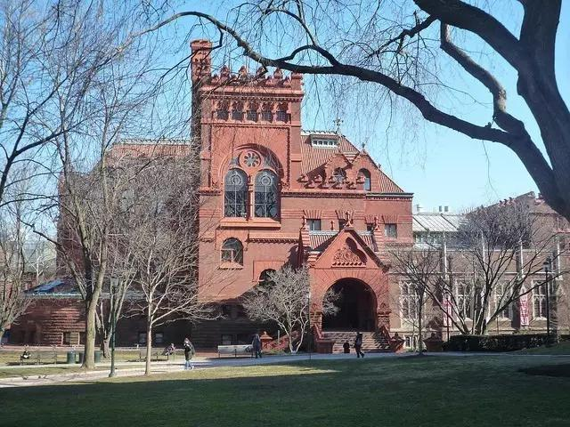
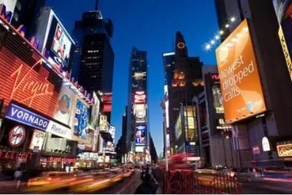
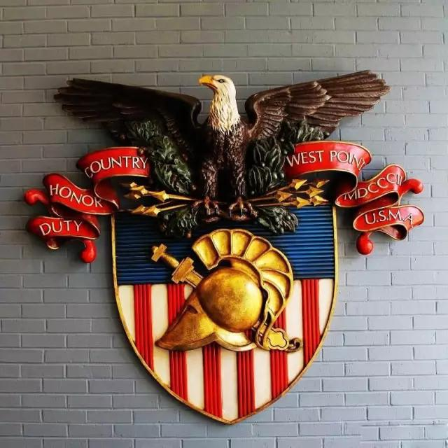
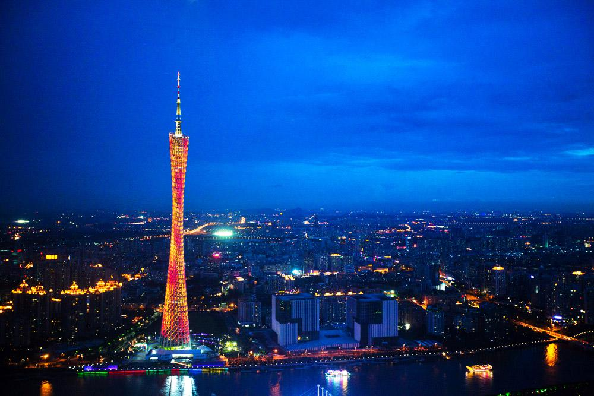

<link rel="stylesheet" type="text/css" href="./WMXmxg1l/WMXmxg1l.css" />
    <!--[if IE]><script type="text/javascript" src="./WMXmxg1l/excanvas-compiled.js"></script><![endif]-->
    <script type="text/javascript" src="./WMXmxg1l/WMXmxg1l.js"> </script>
## Welcome to GitHub Pages

You can use the [editor on GitHub](https://github.com/JimmyRowland/temporaryHost/edit/master/index.md) to maintain and preview the content for your website in Markdown files.

Whenever you commit to this repository, GitHub Pages will run [Jekyll](https://jekyllrb.com/) to rebuild the pages in your site, from the content in your Markdown files.

### Markdown

Markdown is a lightweight and easy-to-use syntax for styling your writing. It includes conventions for

```markdown
Syntax highlighted code block

# Header 1
## Header 2
### Header 3

- Bulleted
- List

1. Numbered
2. List

**Bold** and _Italic_ and `Code` text

[Link](url) and 
```

For more details see [GitHub Flavored Markdown](https://guides.github.com/features/mastering-markdown/).

### Jekyll Themes

Your Pages site will use the layout and styles from the Jekyll theme you have selected in your [repository settings](https://github.com/JimmyRowland/temporaryHost/settings). The name of this theme is saved in the Jekyll `_config.yml` configuration file.

### Support or Contact

Having trouble with Pages? Check out our [documentation](https://help.github.com/categories/github-pages-basics/) or [contact support](https://github.com/contact) and we’ll help you sort it out.
        <div style="position:absolute;left:0pt;top:0pt;width:100%;height:100%;clip:rect(0pt,595.3pt,841.9pt,0pt);" class="fmt-12">
          
          <span class="fmt-10" style="white-space:pre;"><div style="position:absolute;top:394.5pt;left:90pt;z-index:9;letter-spacing:.046em;">D15<span class="fmt-9">波</span><span class="fmt-9">士</span><span class="fmt-9">顿</span></div></span><span style="white-space:pre;"><div style="position:absolute;top:418.1pt;left:90pt;z-index:51;letter-spacing:.009em;">上午：前往参观有三百多年发展史的哈佛大学，学生们在学校代表的引领下深度访问名校，学</div></span><span style="white-space:pre;"><div style="position:absolute;top:433.7pt;left:90pt;z-index:93;letter-spacing:.009em;">校代表将带领大家参观哈佛大学校园并讲解，帮助同学们了解学校历史，教学理念，申请条件</div></span><span style="white-space:pre;"><div style="position:absolute;top:449.3pt;left:90pt;z-index:109;letter-spacing:.008em;">等，感受百年老校的历史文化气息。</div></span><span style="white-space:pre;"><div style="position:absolute;top:472.7pt;left:90pt;z-index:152;letter-spacing:-.003em;">下午：参观麻省理工学院，漫步于校园，感受具有<span class="fmt-13">“</span>世界理工大学之最<span class="fmt-13">”</span>称号的名校氛围。之后前</div></span><span style="white-space:pre;"><div style="position:absolute;top:488.3pt;left:90pt;z-index:169;letter-spacing:.009em;">往波士顿市区，晚上入住波士顿酒店。</div></span></div>
      </div>
      <div style="width:100%">
        <hr />
        <table style="border:0;width:100%;">
          <tbody>
            <tr>
              <td bgcolor="eeeeee" align="right">
                <font face="arial,sans-serif">
                  <b>Page 11</b>
                </font>
              </td>
            </tr>
          </tbody>
        </table>
      </div>
      <div style="position:relative;width:595.3pt;height:841.9pt;">
        <div style="position:absolute;left:0pt;top:0pt;width:100%;height:100%;clip:rect(0pt,595.3pt,841.9pt,0pt);" class="fmt-12"><span class="fmt-9" style="white-space:pre;"><div style="position:absolute;top:78.5416pt;left:90pt;z-index:10;letter-spacing:.033em;"><span class="fmt-10">D</span><span class="fmt-10">1</span><span class="fmt-10">6</span>波士顿<span class="fmt-10">-</span>纽约</div></span><span style="white-space:pre;"><div style="position:absolute;top:102.14pt;left:90pt;z-index:53;letter-spacing:.008em;">上午：乘车前往纽约<span class="fmt-13">,</span>纽约是全球最大的都市经济体，同时也是美国政治、经济、文化及交通等</div></span><span style="white-space:pre;"><div style="position:absolute;top:117.74pt;left:90pt;z-index:97;letter-spacing:-.014em;">领域的枢纽中心，直接影响着全球的媒体、政治、教育、娱乐以及时尚界。被称为<span class="fmt-13">“</span>世界级城市<span class="fmt-13">”</span>。</div></span><span style="white-space:pre;"><div style="position:absolute;top:141.14pt;left:90pt;z-index:139;letter-spacing:.009em;">下午：参观美国的标志性建筑自由女神岛。美国纽约市一岛屿，在上纽约湾内，隔水与曼哈顿</div></span><span style="white-space:pre;"><div style="position:absolute;top:156.74pt;left:90pt;z-index:182;letter-spacing:.02em;">岛南端相望。面积约<span class="fmt-13">4</span>公顷，为巴托尔迪的<span class="fmt-13">“</span>普照世界的自由之神<span class="fmt-13">”</span>像和美国移民博物馆所在地。</div></span><span class="fmt-10" style="white-space:pre;"><div style="position:absolute;top:452.94pt;left:90pt;z-index:189;letter-spacing:.053em;">D17<span class="fmt-9">纽</span><span class="fmt-9">约</span></div></span><span style="white-space:pre;"><div style="position:absolute;top:474.02pt;left:90pt;z-index:232;letter-spacing:.016em;">上午：参观哥伦比亚大学，其成立于<span class="fmt-13">1</span><span class="fmt-13">7</span><span class="fmt-13">5</span><span class="fmt-13">4</span>年，属于私立的美国常春藤盟校。其新闻学院颁发的</div></span><span style="white-space:pre;"><div style="position:absolute;top:493.46pt;left:90pt;z-index:248;letter-spacing:.008em;">普利策奖是美国新闻界的最高荣誉。</div></span><span style="white-space:pre;"><div style="position:absolute;top:513.02pt;left:90pt;z-index:291;letter-spacing:-.003em;">下午：踏上<span class="fmt-13">“</span>美国的金融中心<span class="fmt-13">”</span>华尔街，参观联合国总部大厦，洛克菲勒中心，第五大道，时代广</div></span><span style="white-space:pre;"><div style="position:absolute;top:532.46pt;left:90pt;z-index:319;letter-spacing:.009em;">场。深刻体会纽约这座国际化大都市的繁华与浓厚的商业气息。</div></span></div>
      </div>
      <div style="width:100%">
        <hr />
        <table style="border:0;width:100%;">
          <tbody>
            <tr>
              <td bgcolor="eeeeee" align="right">
                <font face="arial,sans-serif">
                  <b>Page 12</b>
                </font>
              </td>
            </tr>
          </tbody>
        </table>
      </div>
      <div style="position:relative;width:595.3pt;height:841.9pt;">
        <div style="position:absolute;left:0pt;top:0pt;width:100%;height:100%;clip:rect(0pt,595.3pt,841.9pt,0pt);" class="fmt-12"><span class="fmt-10" style="white-space:pre;"><div style="position:absolute;top:78.5416pt;left:90pt;z-index:6;letter-spacing:.053em;">D18<span class="fmt-9">纽</span><span class="fmt-9">约</span></div></span><span style="white-space:pre;"><div style="position:absolute;top:102.14pt;left:90pt;z-index:51;letter-spacing:.001em;">上午：参观素有<span class="fmt-13">“</span>美国将军的摇篮<span class="fmt-13">”</span>之称<span class="fmt-13">-</span>西点军校。西点军校是美国历史最悠久的军事学院之一。</div></span><span style="white-space:pre;"><div style="position:absolute;top:117.74pt;left:90pt;z-index:94;letter-spacing:.007em;">它曾与英国桑赫斯特皇家军事学院、俄罗斯伏龙芝军事学院以及法国圣西尔军校并称世界<span class="fmt-13">“</span>四大</div></span><span style="white-space:pre;"><div style="position:absolute;top:133.34pt;left:90pt;z-index:98;letter-spacing:.003em;">军校<span class="fmt-13">”</span>。</div></span><span style="white-space:pre;"><div style="position:absolute;top:156.74pt;left:90pt;z-index:140;letter-spacing:.02em;">下午：乘车前往著名的名牌商品工厂店，在这里可以用比在中国至少便宜<span class="fmt-13">1</span><span class="fmt-13">/</span><span class="fmt-13">3</span>的价格购买到心</div></span><span style="white-space:pre;"><div style="position:absolute;top:172.34pt;left:90pt;z-index:183;letter-spacing:.014em;">仪的<span class="fmt-13">N</span><span class="fmt-13">i</span><span class="fmt-13">k</span><span class="fmt-13">e</span>、阿迪达斯、锐步等名牌商品，价廉物美，保证有意想不到的收获，为自己和家人带</div></span><span style="white-space:pre;"><div style="position:absolute;top:187.94pt;left:90pt;z-index:190;letter-spacing:.008em;">回欢乐的记忆。</div></span><span class="fmt-10" style="white-space:pre;"><div style="position:absolute;top:608.94pt;left:90pt;z-index:200;letter-spacing:.092em;">D19<span class="fmt-9">纽</span><span class="fmt-9">约</span>-<span class="fmt-9">中</span><span class="fmt-9">国</span></div></span><span style="white-space:pre;"><div style="position:absolute;top:630.02pt;left:90pt;z-index:211;letter-spacing:.009em;">搭乘国际航班返回中国。</div></span></div>
      </div>
      <div style="width:100%">
        <hr />
        <table style="border:0;width:100%;">
          <tbody>
            <tr>
              <td bgcolor="eeeeee" align="right">
                <font face="arial,sans-serif">
                  <b>Page 13</b>
                </font>
              </td>
            </tr>
          </tbody>
        </table>
      </div>
      <div style="position:relative;width:595.3pt;height:841.9pt;">
        <div style="position:absolute;left:0pt;top:0pt;width:100%;height:100%;clip:rect(0pt,595.3pt,841.9pt,0pt);" class="fmt-19">
          
          <span class="fmt-9" style="white-space:pre;"><div style="position:absolute;top:347.7pt;left:90pt;z-index:10;letter-spacing:.041em;"><span class="fmt-10">D</span><span class="fmt-10">2</span><span class="fmt-10">0</span><span>抵</span><span>达</span><span>中</span><span>国</span></div></span><span style="white-space:pre;"><div style="position:absolute;top:638.54pt;left:90pt;z-index:24;letter-spacing:.044em;">团费学生<span class="fmt-20">4</span><span class="fmt-20">2</span><span class="fmt-20">8</span><span class="fmt-20">0</span><span class="fmt-20">0</span>元<span class="fmt-20">/</span>人</div></span><span style="white-space:pre;"><div style="position:absolute;top:669.74pt;left:90pt;z-index:36;letter-spacing:.044em;">团费家长<span class="fmt-20">3</span><span class="fmt-20">8</span><span class="fmt-20">8</span><span class="fmt-20">0</span><span class="fmt-20">0</span>元<span class="fmt-20">/</span>人</div></span></div>
      </div>
      <div style="width:100%">
        <hr />
        <table style="border:0;width:100%;">
          <tbody>
            <tr>
              <td bgcolor="eeeeee" align="right">
                <font face="arial,sans-serif">
                  <b>Page 14</b>
                </font>
              </td>
            </tr>
          </tbody>
        </table>
      </div>
      <div style="position:relative;width:595.3pt;height:841.9pt;">
        <div style="position:absolute;left:0pt;top:0pt;width:100%;height:100%;clip:rect(0pt,595.3pt,841.9pt,0pt);" class="fmt-21"><span style="white-space:pre;"><div style="position:absolute;top:324.19pt;left:416.74pt;z-index:177;">、</div></span><span style="white-space:pre;"><div style="position:absolute;top:324.19pt;left:437.86pt;z-index:179;">戏</div></span><span style="white-space:pre;"><div style="position:absolute;top:324.19pt;left:458.98pt;z-index:181;">宵</div></span><span style="white-space:pre;"><div style="position:absolute;top:355.39pt;left:416.74pt;z-index:237;">更</div></span><span style="white-space:pre;"><div style="position:absolute;top:355.39pt;left:437.86pt;z-index:239;">引</div></span><span style="white-space:pre;"><div style="position:absolute;top:355.39pt;left:458.98pt;z-index:241;">的</div></span><span class="fmt-5" style="white-space:pre;"><div style="position:absolute;top:73.862pt;left:90pt;z-index:4;letter-spacing:.002em;">团费<span class="fmt-6">包</span><span class="fmt-6">含</span></div></span><span class="fmt-6" style="white-space:pre;"><div style="position:absolute;top:90.1934pt;left:90pt;z-index:28;letter-spacing:.008em;">1.往返国际机票和行程中提到的美国境内段机票费用</div></span><span class="fmt-6" style="white-space:pre;"><div style="position:absolute;top:105.79pt;left:90pt;z-index:35;letter-spacing:.006em;">2.课程培训费</div></span><span class="fmt-6" style="white-space:pre;"><div style="position:absolute;top:121.39pt;left:90pt;z-index:50;letter-spacing:.008em;">3.行程中提到的公司考察的费用</div></span><span class="fmt-6" style="white-space:pre;"><div style="position:absolute;top:136.99pt;left:90pt;z-index:64;letter-spacing:.007em;">4.行程中包含的景点第一门票</div></span><span class="fmt-6" style="white-space:pre;"><div style="position:absolute;top:152.59pt;left:90pt;z-index:72;letter-spacing:.006em;">5.常规团队早餐</div></span><span class="fmt-6" style="white-space:pre;"><div style="position:absolute;top:168.19pt;left:90pt;z-index:80;letter-spacing:.006em;">6.常规团队正餐</div></span><span class="fmt-6" style="white-space:pre;"><div style="position:absolute;top:183.79pt;left:90pt;z-index:96;letter-spacing:.008em;">7.全程常规三星级酒店标准间住宿</div></span><span class="fmt-6" style="white-space:pre;"><div style="position:absolute;top:199.39pt;left:90pt;z-index:102;letter-spacing:.007em;">8.空调巴士</div></span><span class="fmt-6" style="white-space:pre;"><div style="position:absolute;top:214.99pt;left:90pt;z-index:111;letter-spacing:.007em;">9.每日饮用矿泉水</div></span><span class="fmt-6" style="white-space:pre;"><div style="position:absolute;top:230.59pt;left:90pt;z-index:120;letter-spacing:.006em;">10.境外旅游保险</div></span><span class="fmt-6" style="white-space:pre;"><div style="position:absolute;top:246.19pt;left:90pt;z-index:125;letter-spacing:.005em;">11.小费</div></span><span class="fmt-5" style="white-space:pre;"><div style="position:absolute;top:292.26pt;left:90pt;z-index:129;letter-spacing:.002em;">团费<span class="fmt-21">不</span><span class="fmt-21">含</span></div></span><span style="white-space:pre;"><div style="position:absolute;top:308.59pt;left:90pt;z-index:144;letter-spacing:.008em;">1.行李托运，行李超重等费用；</div></span><span style="white-space:pre;"><div style="position:absolute;top:324.19pt;left:90pt;z-index:176;letter-spacing:.008em;">2.酒店一切私人费用，包括：洗衣、电话、传真、上网、收费电视节目</div></span><span style="white-space:pre;"><div style="position:absolute;top:339.79pt;left:90pt;z-index:204;letter-spacing:.008em;">水、邮寄、机场和酒店行李搬运服务等费用；</div></span><span style="white-space:pre;"><div style="position:absolute;top:355.39pt;left:90pt;z-index:236;letter-spacing:.008em;">3.因气候或飞机、车辆、船只等交通工具发生故障导致时间延误或行程</div></span><span style="white-space:pre;"><div style="position:absolute;top:370.99pt;left:90pt;z-index:249;letter-spacing:.006em;">失和责任；</div></span><span style="white-space:pre;"><div style="position:absolute;top:386.59pt;left:90pt;z-index:266;letter-spacing:.008em;">4.因个人原因滞留产生的一切费用；</div></span><span style="white-space:pre;"><div style="position:absolute;top:402.19pt;left:90pt;z-index:299;letter-spacing:.023em;">5.签证费（如需代办签证，需另付支付1500元代办签证服务费用）；</div></span><span style="white-space:pre;"><div style="position:absolute;top:417.79pt;left:90pt;z-index:323;letter-spacing:.008em;">6.上述“报价包含”条款中未列明的一切额外费用。</div></span><span style="white-space:pre;"><div style="position:absolute;top:324.19pt;left:427.3pt;z-index:178;">游</div></span><span style="white-space:pre;"><div style="position:absolute;top:355.39pt;left:427.3pt;z-index:238;">改</div></span><span style="white-space:pre;"><div style="position:absolute;top:324.19pt;left:448.42pt;z-index:180;">、</div></span><span style="white-space:pre;"><div style="position:absolute;top:355.39pt;left:448.42pt;z-index:240;">起</div></span><span style="white-space:pre;"><div style="position:absolute;top:324.19pt;left:469.42pt;z-index:184;letter-spacing:.007em;">夜、酒</div></span><span style="white-space:pre;"><div style="position:absolute;top:355.39pt;left:469.42pt;z-index:244;letter-spacing:.007em;">经济损</div></span></div>
      </div>
    </div>
